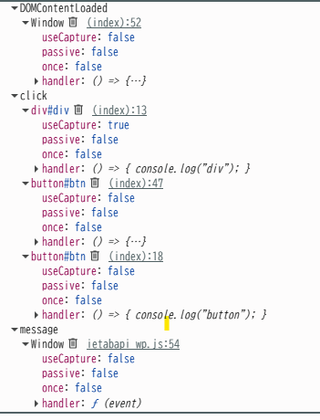

以下の html を開き、ボタン押下時のコンソール出力結果を確認しなさい。
```shell
div
button
```

次に capture の値を変更し div と button のコンソール出力順序が逆になることを確認しなさい。
capture: false
```shell
button
div
```

更に script 中のコメント 1.～ 4.の指示に従いカスタムイベントの関連コードを完成させなさい。

最後にブラウザのデバッグツール(Chrome の場合は Developer Tool の Event Listners)で、btn 等に登録されているイベントをそれぞれ確認しなさい。


