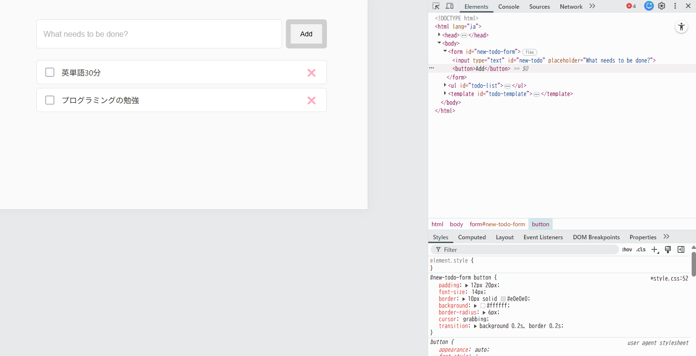
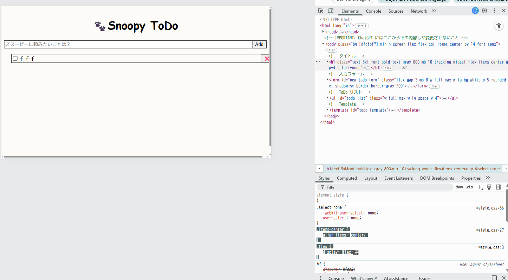
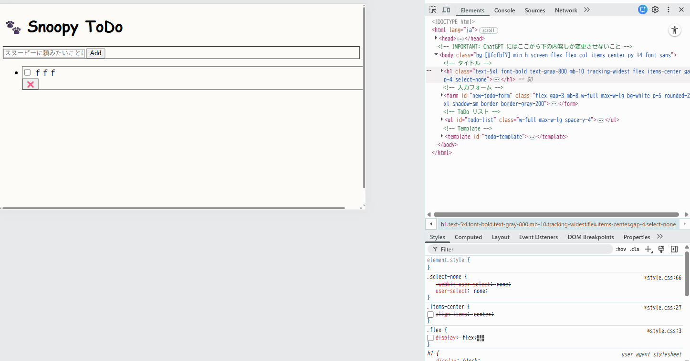

## 問題 15.4-10.3 🖋️
ブラウザの開発者ツールを使うと CSS のデバッグを効率的に行うことができる。 CSS のデバッグ を参考にして以下を実施しなさい:

### 15.4-10.1 および 15.4-10.2 の ToDo アプリに対してブラウザの開発者ツールから値の変更やプロパティの追加を試してみなさい

カーソルを grabbing にし、枠線を 1px → 10px に

```js
#new-todo-form button {
    padding: 12px 20px;
    font-size: 14px;
    border: 10px solid #e0e0e0;
    background: #ffffff;
    border-radius: 6px;
    cursor: grabbing;
    transition: background 0.2s, border 0.2s;
}
```

以下2か所を変更すると、中央寄せが左寄せになり、箇条書きの「・」の表示が残り、横幅全体に子要素が並ばなくなる
```js
.items-center {
    /* align-items: center; */
}
.flex {
    /* display: flex; */
}
```




### 開発者ツールで CSS に関して実行できる操作を検索エンジンで調べ、便利だと思ったものを 3 つ挙げなさい

- [クラスに疑似状態を追加する](https://developer.chrome.com/docs/devtools/css?hl=ja#pseudostates)
- [変更内容を確認する](https://developer.chrome.com/docs/devtools/changes?hl=ja#view-changes)
- [ファイルに加えたすべての変更を元に戻す](https://developer.chrome.com/docs/devtools/changes?hl=ja#revert-changes)


### 15.4-10.2 のアプリの body 要素に対し、元々 HTML および JS 内で利用していなかった Tailwind CSS のクラス (bg-rose-600 など何でも良い) を開発者ツールから追加すると変更が反映されないが、これは何故か調べなさい

利用方法として以下の 2 つのパターンがある。
1. Next.js でコンパイルし、ビルド時に使われているクラスだけを解析して出力する
2. 非推奨だが開発環境 CDN 版の Tailwind を使う

今回は、①の方法でビルドした CSS を使っており、開発者ツールで追加したクラスは CSS に存在しないため。
