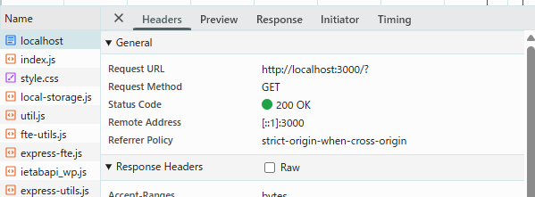
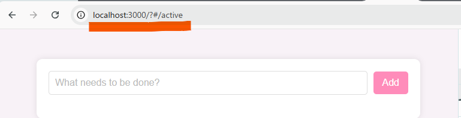
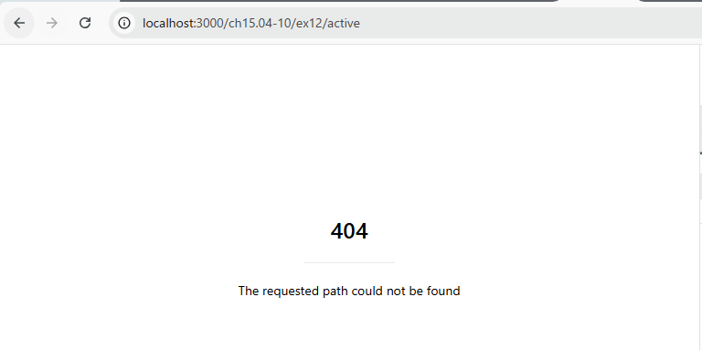
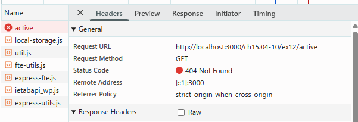

## 問題 15.4-10.12 🖋️💻

### Active や Completed を選択後にブラウザのリロードを行うとどうなるだろうか。hashchange と pushState それぞれの実装について調べなさい (ヒント: 開発者ツールでどのような通信が発生しているか調べてみなさい)。

hashchange はハッシュをブラウザのみで管理しているため、リクエストURL は、元の通り「http://localhost:3000/?」であり、追加していた content がなくなる。 ただ、URL のハッシュはブラウザ保存されているため、そのまま表示される。

pushState は URL 自体を書き換える（リロードしないうちはリクエスト URL は変わらない）ため、リロードするとリクエスト URL が変わってしまい `404 エラー` となる。

### ここまでの例は serve コマンドで HTML や JS といったファイル配信するサーバーを立ち上げてきた。 サーバー側がどのような挙動をすれば pushState を使った実装が期待通り動作するか考えて答えなさい。

リクエスト先が存在しないことが問題である。
サーバー側で、どんなリクエストに対しても必ず特定のHTMLを返すようにする（index.html が無難？）。

Single Page Application([SPA (単一ページアプリケーション) - MDN Web Docs 用語集 | MDN](https://developer.mozilla.org/ja/docs/Glossary/SPA))の初期URLを返す。

"server": "serve `-s`"
と設定することで、SPA モードにすることができる。
実際試したところレスポンスが返ってきた（パスの問題でCSSなどは参照できなかった）
