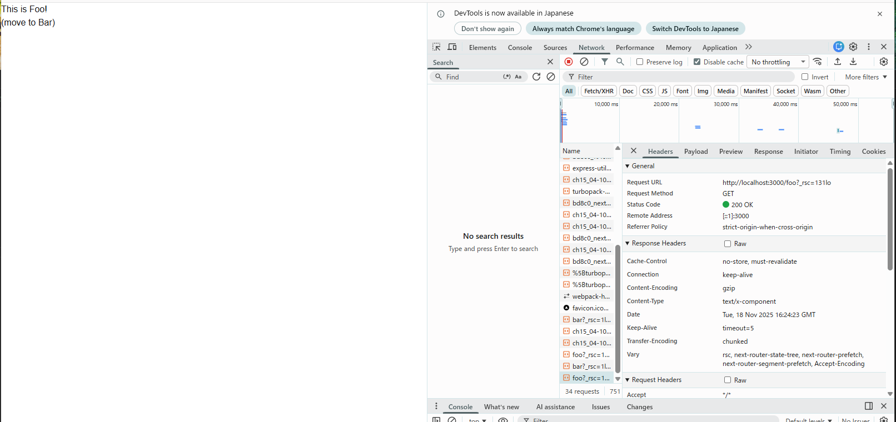
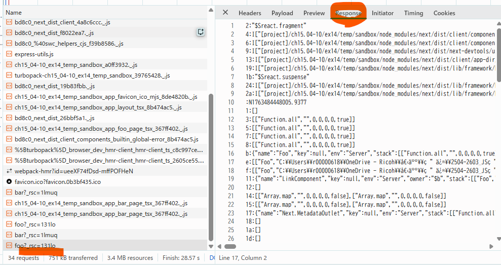

## 問題 15.4-10.14 🖋️

### 1. 以下の動作を確認しなさい

#### ブラウザの開発者ツールの「ネットワーク」タブを確認してみよう。リンクをクリックしたときに通信は発生しているだろうか？

発生している。ページ遷移してもコンソールのログが残っていることからも、全体のリロードではなく、必要なコンポーネントやデータだけを fetch して画面を差分更新していることが分かる。

#### pushState はいつ実行されているだろうか？

リンクをクリックした瞬間（コンソールの表示より）。内部で router.push() が呼ばれ、URL と履歴が更新され、コンソールや JavaScript は保持される。
（[参考①](https://nextjs.org/docs/app/getting-started/linking-and-navigating:~:text=Traditionally%2C%20navigation%20to%20a%20server%2Drendered%20page%20triggers%20a%20full%20page%20load.%20This%20clears%20state%2C%20resets%20scroll%20position%2C%20and%20blocks%20interactivity.)、[参考②](https://nextjs.org/docs/app/getting-started/linking-and-navigating#prefetching)、[参考③](https://nextjs.org/learn/pages-router/navigate-between-pages-client-side)）

#### リロード時に画面の表示はどうなるだろうか？

ページリロード時には pushState は呼ばれない。コンソールの初期化、画面の再描画が発生していることが分かる。
ただしページの切り替えが早く、画面表示からはリロードされているとわかりづらい。

### 2. 1 で確認した動作と 15.4-10.12 で確認した動作を比較し、next.js の Link でどういった処理が行われているかをまとめなさい。

#### a
クリック時に、HTTP GET リクエストを送信してサーバーから HTML 全体を取得する。
フルページリロードが発生し、コンソールや JavaScript の変数などの状態は初期化される。

#### link
クリック時、部分的な fetch でリクエストを送信してサーバーからHTML全体ではなく必要な差分だけを取得している。
またプリフェッチ機能により、ユーザーがリンクをクリックする前に次のページのデータを先読みしておくため、遷移が高速化できる。
`router.push()`メソッドを使うことでフルリロードは発生せず、コンソールや JavaScript の変数などの状態は保持される。
SPA のような挙動を実現する。

