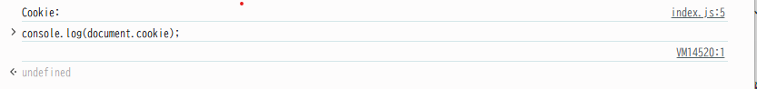

## このサーバでは Cookie を使ってクライアントのセッションを識別し、タスク一覧をセッションごとに分離して管理する簡易的な認証/認可を行っている。サーバが設定している Cookie の値は sid=<セッションに一意に割り当てた ID>; SameSite=Lax; Path=/; HttpOnly; である。ToDo アプリでいくつかのタスクを作成した後、以下に挙げる操作を実施したとき、それぞれどのような結果になるか記載し、その理由を説明しなさい。

### index.js でdocument.cookie プロパティを console.logで表示する

何も表示されない。`HttpOnly;` が設定されているため。
「HttpOnly 属性を持つ Cookie は、 JavaScript の Document.cookie API にはアクセスできません。サーバーに送信されるだけです。」（[参考](https://developer.mozilla.org/ja/docs/Web/HTTP/Guides/Cookies#:~:text=HttpOnly%20%E5%B1%9E%E6%80%A7%E3%82%92%E6%8C%81%E3%81%A4%20Cookie%20%E3%81%AF%E3%80%81%20JavaScript%20%E3%81%AE%20Document.cookie%20API%20%E3%81%AB%E3%81%AF%E3%82%A2%E3%82%AF%E3%82%BB%E3%82%B9%E3%81%A7%E3%81%8D%E3%81%BE%E3%81%9B%E3%82%93%E3%80%82%E3%82%B5%E3%83%BC%E3%83%90%E3%83%BC%E3%81%AB%E9%80%81%E4%BF%A1%E3%81%95%E3%82%8C%E3%82%8B%E3%81%A0%E3%81%91%E3%81%A7%E3%81%99%E3%80%82)）

### ブラウザの開発者コンソールで http://localhost:3000/ の Cookie を表示する

`undefined` と表示される。
前述のとおり、クライアントスクリプト（JavaScript）からアクセスすることはできないため。

### ToDo アプリのタブをリロードする

タスクの内容や状態は残り、開発者ツールのコンソールは消える。すべてのリクエストは投げられる。
「クッキーの有効期間は、現在のブラウザのセッションが終わるまで」 (15.12.2.3 クッキーの保存) であり、リロードでは消去されないため。

### 同一ブラウザの異なるタブやウィンドウで http://localhost:3000/ を開いて ToDo リストの状態を確認する

タスクの状態は残っている。
前述のとおり、クッキーの有効期間はブラウザのセッションが終わるまでであることから、タブやウインドウが別でも同じブラウザであれば状態は残る。
ただし、Cookie は該当する URL へのリクエストごとに自動送信されるため、リクエストは送信されている。

### シークレットウィンドウや異なるブラウザで http://localhost:3000/ を開いて ToDo リストの状態を確認する

タスクはすべてクリアされた状態。
シークレットモードは一時的なセッションであり、「閲覧履歴」「Cookieとサイトデータ」「フォームに入力した情報」などは共有されないため。

### http://127.0.0.1:3000/ を開いて ToDo リストの状態を確認する

タスクはすべてクリアされた状態。
今回はホスト名が異なっており、生成元が異なる Web ページとして扱われるため、localhost のクッキーは保持されない。(教科書 p.592 l.8)

（課題とは関係ない：`GET http://127.0.0.1:3000/favicon.ico 404 (Not Found)` と表示される。）

