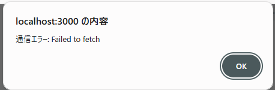
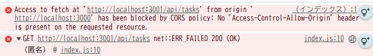
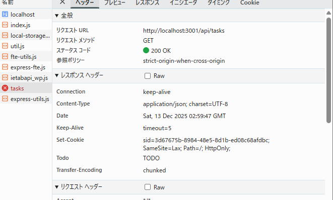

### 最初のエラー

エラーは、API の URL に対して OPTIONS メソッドのリクエストを送り、レスポンスが 404 のため発生している。200 なので、サーバからはレスポンスが返ってきているが、ブラウザが破棄。

### contents/index.js で、fetch のオプション設定を変更し、CORS モードでのリクエスト送信と、クロスオリジンでの Cookie の送信を許可する

### server.js で以下の箇所を変更して、http://localhost:3000 からのクロスオリジンリクエストを許可する
