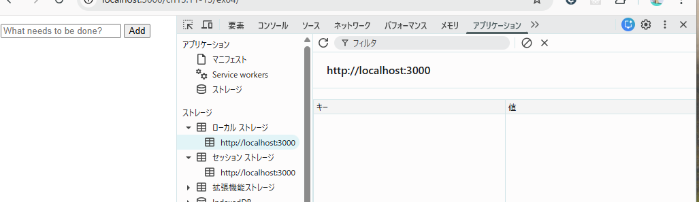
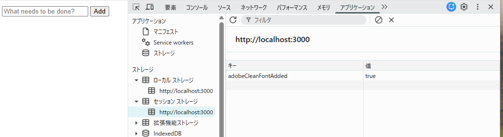

## localStorage と sessionStorage それぞれに保存されたデータの有効期限がどのように異なるか、実際に動作確認して結果を記述しなさい。

localstorage
セッションが残る範囲
・リロード
・タブを移動して再度開く
・新しいタブ
・サーバ再起動（閉じたタブを開く）
・ブラウザを開き直す
・別タブ（自動同期）
残らない範囲
・明示的に削除した場合

sessionstorage
セッションが残る範囲
・リロード
・タブを移動して再度開く
・サーバ再起動（閉じたタブを開く）
残らない範囲
・新しいタブ
・ブラウザを開き直す
・別タブ（自動同期）
・明示的に削除した場合

（以下教科書）
localStorage 
・保存されたデータは永続的
・Web アプリケーションがそのデータを削除するまで、または（ブラウザのUIを使って）ユーザがブラウザに削除するように指示するまで

sessionStorage
・データを保存したスクリプトが実行されている最上位ウィンドウやブラウザタブと同じ
・ウィンドウやタブが閉じられたときは、sessionStorageを使って保存されたデータは削除される（しかし、最近のブラウザでは、最後に閉じたタブを再度開いたり、直前のブラウザセッションを復元したりできるので、これらのタブなどに関連するsessionStorage の有効期間はもう少し長いものになっています）。
