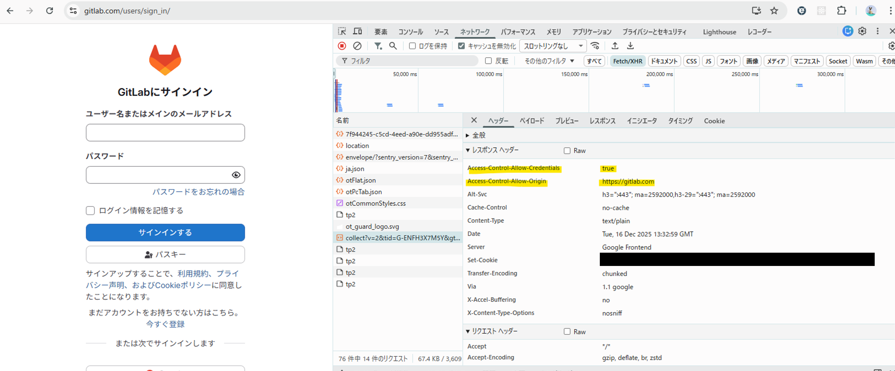
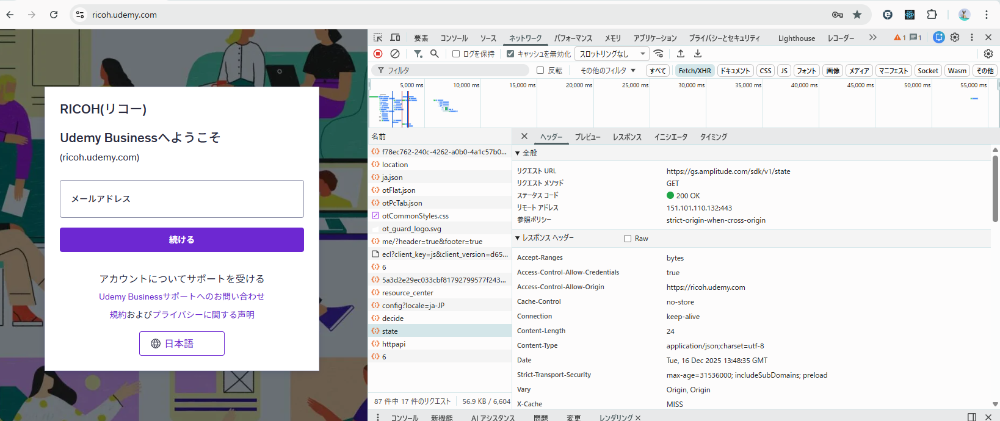
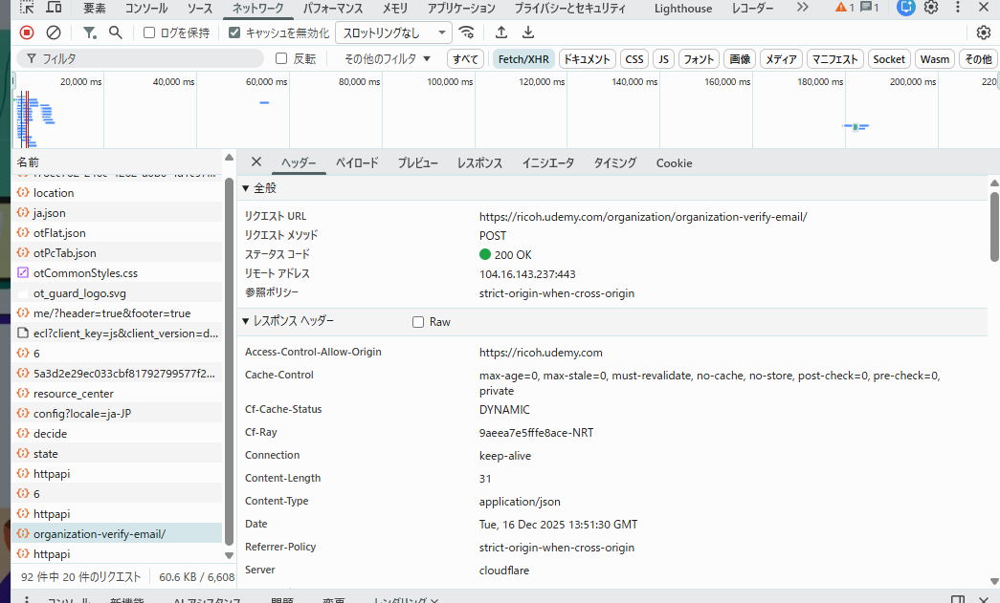
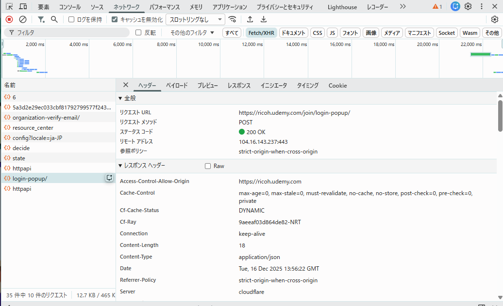

### ログイン前

（CORS とは関係ないが、GitLab に関しては Set-Cookie が設定されていた。
別タブでログイン画面を開くと Max-Age が異なっており、Cookie が発行時刻を基準とした短命なものであることが確認できた。認証フローごとに一時的な Cookie が発行されている。）

### メールアドレス入力時
Cookie 未使用、セッション未確立、資格情報未送信、でセキュリティリスクが低いため、指定が緩い

### ログイン時

