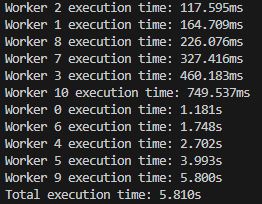
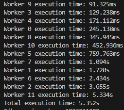
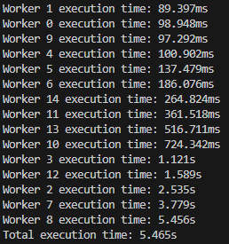
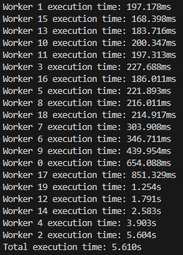

# 問題 16.1 🖋💻

## 用語「マルチスレッド」について調べなさい。

マルチスレッド：　「1つのプロセスの中で複数のスレッドを同時（もしくは擬似的に同時）に動かす」仕組み
各スレッドはCPUから見た実行単位であり、**同じプロセスのメモリ空間を共有しつつ**、同じプロセス内で並行して処理を進める。

【利用場面】　画像変換・動画エンコード・暗号化・大量の数値計算など、CPUをかなり使う処理を行うとき
※逆に、I/O中心のWeb APIやバックエンドでは、まずはシングルスレッド＋ノンブロッキングI/Oで十分なことが多い。必要に応じてマルチスレッドやマルチプロセスを組み合わせていくのが一般的

【問題点】　競合・デッドロック
スレッドを高速に切り替えながら処理するため、複数スレッドが同じデータを同時に変更したり、互いに処理待ちになったりする可能性がある

【実現方法】
複数のCPUコア　→　マルチスレッド処理が可能
単一のCPUコア　→　利用時間を分割し、順番を割り当てることで擬似的にマルチスレッドが可能
Linux、Windows、macOSなどの一般的なOSでは、カーネルスレッドとして扱われることが一般的。
| スレッドの管理      | 実行制御            | OSの視点        |
| ------------ | --------------- | ------------ |
| **カーネルスレッド** | OSが直接管理         | 個々のスレッドを認識   |
| **ユーザースレッド** | プログラム（ライブラリ）が管理 | 1つの単位として扱われる |


（教科書16.2 16.11.1, [NTT西日本](https://business.ntt-west.co.jp/glossary/words-00262.html), [qiita](https://qiita.com/kts64/items/cf4c17d772f7273b9225), [note](https://note.com/kodai_code/n/n43902022dbd4), [IBM](https://www.ibm.com/docs/ja/aix/7.2.0?topic=processes-kernel-threads-user-threads)）

<details><summary>Node.js メモ</summary>

Node.jsは元々シングルスレッドであるが、worker_threads モジュールを使うことで、メインスレッドとは別にワーカースレッドを作成し、マルチスレッド処理を行える。
ただし、サーバのようなI/O を多用するプログラムではあまり使われない。また、メモリの共有が難しいことに注意。

</details>

## 次にフィボナッチ数を計算するmFib.jsをスレッド数を変更しながら実行し(*1)、コンソール出力とOS機能(*2)で結果とスレッド数を確認しなさい。

Nodeのworker間通信はメッセージパッシング中心で、スレッドを増やすほどスレッドの作成・管理や結果のやり取りのオーバーヘッドが増える。
そのため、性能向上は頭打ちになる。
また、Nodeの内部処理によりワーカー数が1でもOS上では十数本（今回は17本）のスレッドが存在するため、OSのスレッド数はワーカー数と一致しない。

`node .\ex01\mFib.js 項数 スレッド数 `
結果：Fibonacci: 1836311902
| スレッド数 | 実行時間 | OS機能スレッド数 |  |
|---:|---:|---:|---:|
| 10スレッド | 5.469s | 26 |  |
| 5スレッド  | 5.977s | 21 |  |
| 4スレッド  | 6.307s | 20 |  |
| 3スレッド  | 6.634s | 19 |  |
| 2スレッド  | 7.835s | 18 |  |
| 1スレッド  | 11.909s | 17 |  |

<details><summary>図を表示／折りたたむ</summary>


11 
12 
15 
20 

</details>

## 最後にあなたのPCのCPUスペックを調査し、適切なスレッド数についての考察を記しなさい。

前問の通り、ワーカー数が1であってもNode.jsの内部処理によりOS上では複数のスレッドが存在する。
しかし、CPUを用いた計算処理を行うのは主にワーカースレッドである。
私のPCはコア数が 10、論理プロセッサ数が 12 であるため、OSの余裕を考慮すると、適切なワーカー数は `10～12程度` と考えられる。

```
CPUバウンド（計算中心）の場合：物理コア数に近いスレッド数が基本。
SMT（論理プロセッサ）を有効にしているなら、物理コア数×(SMTの有効度合い)を上限の目安にする。
多くは物理コア数～論理プロセッサ数の間で最大性能を得る。
```
（参考：https://everplay.jp/column/18939）


