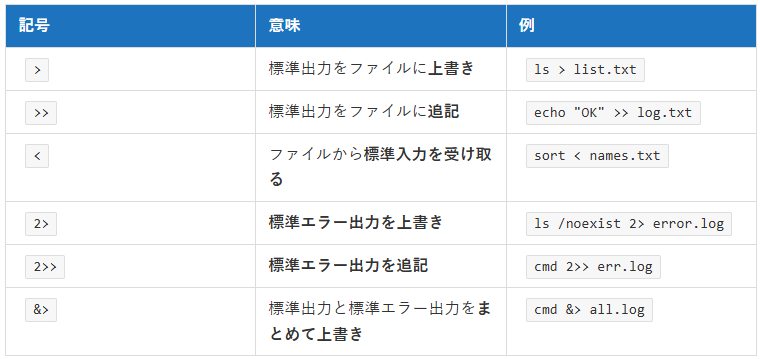

## 問題 16.5 🖋️💻

### 1. 標準入力、標準出力、標準エラー出力、リダイレクト、パイプという単語について調べなさい

| 用語 | 説明 | 例 |
|---|---|---|
| 標準入力   （stdin） | プログラムが特に指定がない場合に利用する入力元。   通常は、キーボードや他コマンドから渡されるデータ。 | `echo "hello" \| node script.js`   のように実行すると、標準入力として渡された   `process.stdin.on("data", data => {  console.log(data.toString());});`   のように受け取って扱うことができる。   ファイル記述子は、`0`（省略可能） |
| 標準出力   （stdout） | プログラムの通常の実行結果を出力する標準的な出力先。   通常は、画面（端末）。 | `echo "hello"` したときに結果が表示されるコンソール。   ファイル記述子は、`1`（省略可能） |
| 標準エラー出力   （stderr） | エラーメッセージなどを出力するための出力先。   stdoutとは独立して別に扱える。 | `cmd 2> err.txt` のように、ファイル記述子`2`で出力可能 |
| リダイレクト   （>, <, 2>, &>） | 標準入出力や標準エラー出力の入出力先を、ファイル等に切り替えたり統合したりする仕組み（シェルの機能）。 |  |
| パイプ   （\|） | あるコマンドの標準出力（stdout）を、次のコマンドの標準入力（stdin）に接続する仕組み。   ※ 標準エラー出力（stderr）は通常パイプされない。 | `ls \| grep txt` |

**＜参考＞**
- https://it-study-place.com/171/
- https://qiita.com/keisuke-nakata/items/b5c4ae1c663c0b2e14a9

***

### 2. 以下のコードを `cat.mjs` というファイルに保存し、後述する実験の結果を予測し、実際に実験しなさい

**出題範囲**: 16.1

実験: `file` は適当なファイルとし `invalid-file` は存在しないファイルとしなさい

- `node cat.mjs`
コマンドライン引数がないため else に入り、何も出力されない。
→　✖。何も出力されずプロセスが終わらない。ターミナルに`hello`など入力・送信するたびにcat.mjsは実行されるが、閉じない。
なぜなら、process.stdin は以下どれかが起こらない限りループが終わらないため。
　①パイプの書き込み側が終了する
　②ファイル入力を最後まで読み切る
　③ユーザーが明示的に EOF を送る
- `echo FOO | node cat.mjs`
`FOO`とコンソール出力される
→　〇
- `node cat.mjs > output-1.txt`
output-1.txtファイルが作成されるが、コマンドライン引数がないため中身は空でプロセスも終わらない。
→　〇
- `node cat.mjs file.txt`
file.txt内の文字列`ただのテキスト`がコンソールに出力される。
→　〇
- `node cat.mjs file.txt > output-2.txt`
output-2.txtファイルが作成され、中にはfile.txt内の文字列`ただのテキスト`が出力されている。
→　〇。（ただし、file.txtはUTF-8（BOM付き））
- `node cat.mjs invalid-file.txt > output-3.txt`
output-3.txtファイルが作成され、引数で指定したファイルが存在せずエラーになるが、標準出力になっているため中身は空になる。
→　✖。エラー内容はコンソールに出力される。
- `node cat.mjs invalid-file.txt 2> error.txt`
output-3.txtファイルが作成され、引数で指定したファイルが存在せずエラーになり、中身にエラー出力内容が出力される。
→　〇。

参考：16.1.3 ライフサイクル
