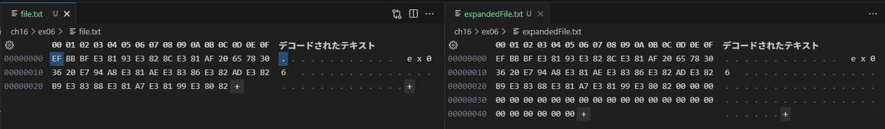
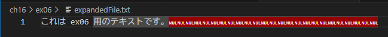

## 問題 16.6 🖋️💻

P.664 では `fs.truncate()` を利用してファイルを拡張した場合には拡張された部分には 0 が書き込まれる、と説明されていますが、これは ASCII の"0"が書き込まれるという意味ではありません。
実際に `fs.truncate()` を利用してファイルを拡張し、拡張されたファイルの内容をバイナリエディタ(Stirling や VSCode の HexEditor 拡張機能等)で確認しなさい。

**出題範囲**: 16.7

### 回答

ASCII の"0"（`0x30`）という文字が書き込まれるのではなく、`0x00`（NUL）が書き込まれる。
