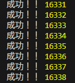

## また、複数のTCPクライアント (net.Socket) でHTTPリクエストを送信せず同時に接続を維持した際、何接続で接続が確立できなくなるか確認し、確立できなかった理由を書きなさい。

10,000 回の場合、127 まで実行して一度停止するが、最終的には最後まで到達した。
13,000 回でも接続は確立できた。
20,000 回では、16,338 回成功したところで処理が停止した。

これは、TCP ソケットが OS のファイルディスクリプタを消費し、プロセスあたりのディスクリプタ上限（おそらく `16384（2^14）`）に達したためと考えられる。
127 付近で一時的に停止したのは accept 処理やスケジューリングによる一時的な遅延であり、上限とは関係がないと考える。

