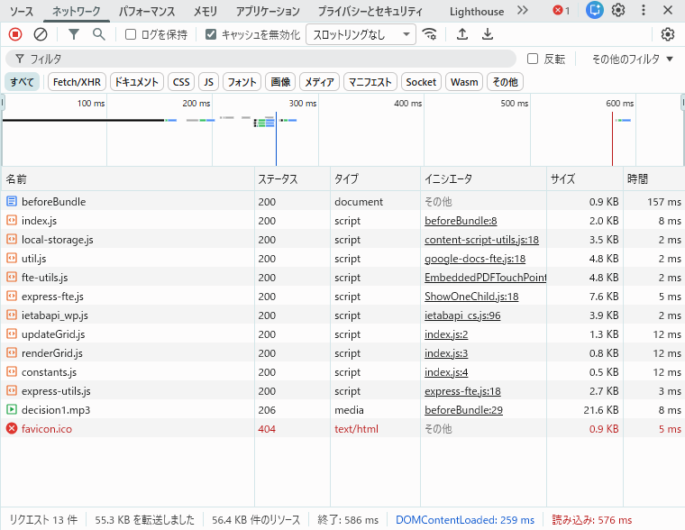
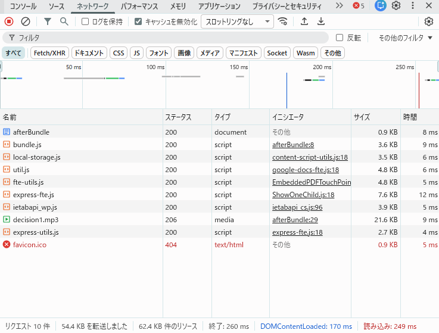

## 問題 17.5 💻🖋️

[問題 15.4-10.10](../ch15.04-10/README.md#問題-154-1010-) で作成したライフゲームのプログラムについて、プログラム中の関数(`updateGrid`, `renderGrid`)をそれぞれ別のファイルで export し、`index.js` から import して利用するよう修正しなさい。必要に応じて定数の export や関数の引数の変更を行ってもよい。
上記のコードを webpack を利用してバンドルし、バンドル前後のコードについて以下の点を調査して結果を記載しなさい。

### バンドルしたコードと元のコードを比較し、どのような処理が行われたかを確認しなさい。

`npm i -D webpack webpack-cli`
package.json に `"build": "webpack"`を追加

```shell
npm run build

> ch17@1.0.0 build
> webpack --config ex05/webpack.config.js

asset bundle.js 11.3 KiB [emitted] (name: main)
runtime modules 670 bytes 3 modules
cacheable modules 5.49 KiB
  ./ex05/src/index.js 3.98 KiB [built] [code generated]
  ./ex05/src/updateGrid.js 941 bytes [built] [code generated]
  ./ex05/src/constants.js 124 bytes [built] [code generated]
  ./ex05/src/renderGrid.js 476 bytes [built] [code generated]
webpack 5.105.2 compiled successfully in 187 ms
```

■ バンドル前（index.js / renderGrid.js / updateGrid.js / constants.js） 
- index.js が入口で、updateGrid / renderGrid / constants を ES Modules の import/export で分割して利用している。
- ブラウザは（type="module" で読み込む場合）index.js を起点に依存ファイルも追加で取得して実行する。

■ バンドル後（bundle.js） 
- webpack により4ファイルが 1本の JS に統合される。
- import/export は、webpack のモジュール読み込み関数 __webpack_require__ と export 定義処理に変換される。
-__webpack_modules__（モジュール表）と __webpack_module_cache__（キャッシュ）が追加され、最後に entry（index.js 相当）が起動される（__webpack_require__("./ex05/src/index.js")）。

### バンドル前後それぞれのコードを利用するページをローカルサーバで配信してブラウザから閲覧できるようにしなさい。<br>開発者ツールで `ネットワーク` タブを開き、スクリプトのダウンロード時間、ページの読み込み完了時間について比較しなさい。

`npm install -D serve` を実行




#### ■スクリプトのダウンロード時間の比較

| 項目         | バンドル前  | バンドル後 |
| ---------- | ------ | ----- |
| JSファイル数    | 4本     | 1本    |
| JSダウンロード時間 | 約44 ms（8+12+12+12） | 9 ms  |

バンドル前は、4つのJSファイルを個別にダウンロードしており、合計約44ms。
バンドル後は bundle.js 1本のみとなり、9ms。
その結果、通信回数が減り、ダウンロード時間が短縮された。

#### ■ページの読み込み完了時間の比較
バンドル後は JavaScript が1ファイルに統合されたため、リクエスト数が減少した。
その結果、Load時間が 576ms から 249ms に短縮され、ページの読み込み完了が高速化されたと考えられる。
一方で、webpack のモジュール管理処理（__webpack_require__ 等）や起動コードが追加されたため、リソース総量はやや増加している。

以上より、バンドルによってファイル管理が効率化され、通信回数の削減により読み込み性能が向上することが確認できた。

| 項目               | バンドル前   | バンドル後   |
| ---------------- | ------- | ------- |
| リクエスト数           | 13 件    | 10 件    |
| 転送量              | 55.3 KB | 54.4 KB |
| リソース総量           | 56.4 KB | 62.4 KB |
| DOMContentLoaded | 259 ms  | 170 ms  |
| 読み込み（Load）       | 576 ms  | 249 ms  |
| 終了（Finish）       | 586 ms  | 260 ms  |
