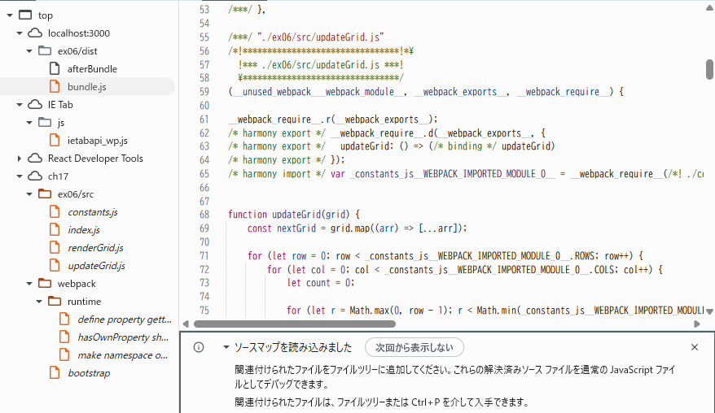
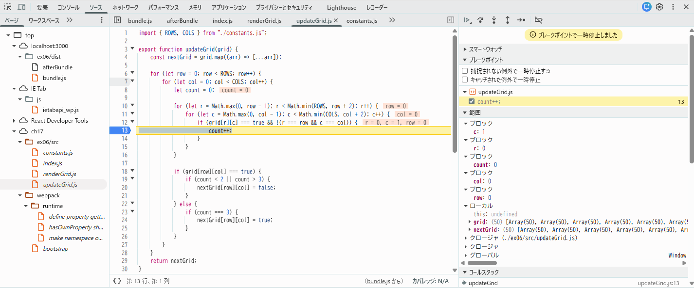

## 問題 17.6 🖋️

[問題 17.5](#問題-175-) について、webpack の設定でバンドル時にソースマップを生成するようにしなさい。
バンドルしたコードを利用するページをローカルサーバで配信してブラウザから閲覧し、開発者コンソールを利用して以下を確認して結果を記載しなさい。

### 開発者ツールで `ソース` タブ(Chrome, Edge, Safari) または `デバッガー` タブ(Firefox) を開き、ソースコードファイルがどのように表示されるかを確認しなさい。

bundle.js 実行中でも、Sources に webpack://（等）配下で
index.js / renderGrid.js / updateGrid.js / constants.js が表示された。

### バンドルしたコードの実行中に、バンドル前のソースコードファイルに基づいたブレークポイントの設定や変数の値の確認等のデバッグが可能か確認しなさい。

updateGrid.js や renderGrid.js の任意行(count++)にブレークポイントを置くと停止した。
停止中に grid などの変数値を確認でき、ステップ実行も可能だった。

