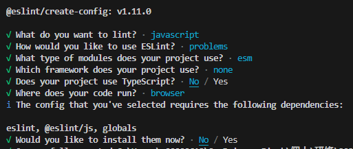

eslint.config.js
　ESLint が読む設定ファイル本体
--write オプション
　Prettier の scripts 実行時は警告が表示＋コードの修正がされるようにする
eslint-config-google　→　[GitHub](https://github.com/google/eslint-config-google)
　Google JavaScript スタイル ガイド用のESLint共有可能な設定(ES2015+ バージョン)
eslint-config-prettier　→　[GitHub](https://github.com/prettier/eslint-config-prettier)
　不要なルールやPrettierと競合する可能性のあるルールをすべてオフにします。
`eslint:recommended`
　コードの正確性のための推奨ルール群を使うために必要。今回はgoogleに入っている・

```shell
npm uninstall -D eslint@9 prettier eslint-config-google eslint-config-prettier @eslint/eslintrc
npm i -D eslint@8 prettier eslint-config-google eslint-config-prettier
```

`npm run lint`
`npm run format`
などで実行

```

```

---

---

### 失敗

V9でやろうとしたが、よく分からなかったため結局V8にした

```shell
npm i -D eslint@9 prettier eslint-config-google eslint-config-prettier @eslint/eslintrc
```

@eslint/eslintrc 内 `FlatCompat`　→　[公式](https://eslint.org/docs/latest/use/configure/migration-guide)
　.eslintrc.js や .eslintrc.json が V9以降 eslint.config.js に変わったため、新しい形式で書いてくれる
　→　今回はV9にしてみる
import { defineConfig } from "eslint/config";
　export 時のミスを減らす

```shell
npm init -y # README の1行目を description に勝手に入れる
npm install -D eslint prettier
npm install eslint eslint-config-google
npm init @eslint/config
```


